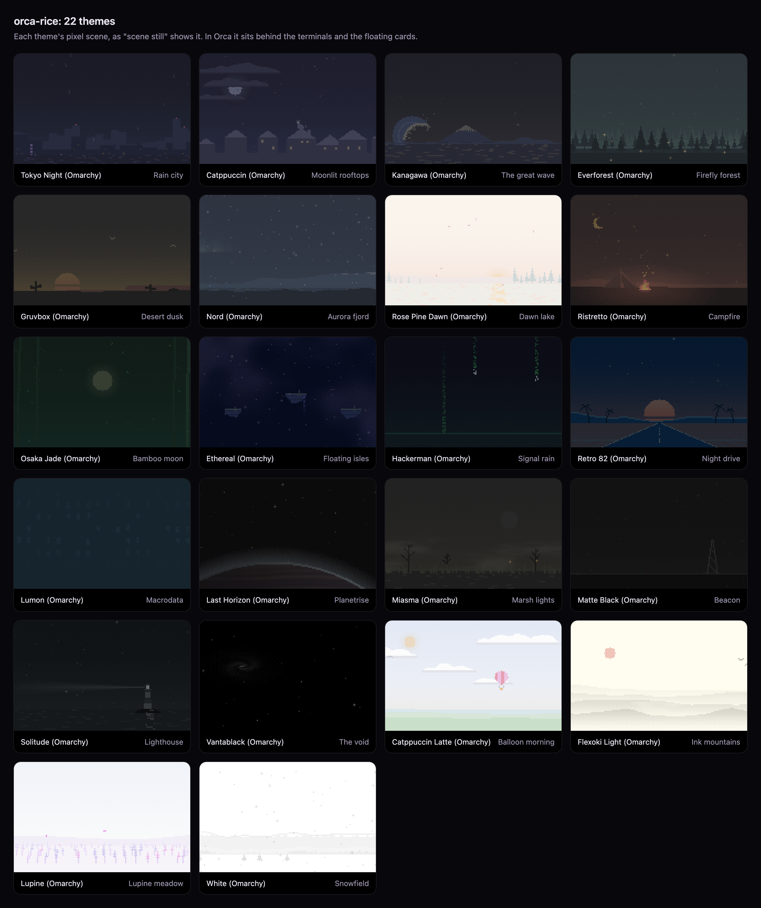

# orca-rice

Themes, floating cards and pixel-art scenes for [Orca](https://github.com/stablyai/orca), the workspace for running
coding agents. Your own agent sets it up for you.



## Get it

Open Orca, start Codex or Claude Code in **plan mode**, and paste:

> Read https://github.com/denonmaryland/orca-rice (start with AGENTS.md) and make me a plan to give my Orca this
> look. Check my setup first, ask me which theme I want, and don't change anything until I approve.

Your agent checks your Mac, asks you a few questions (theme, scene, shape), and shows you a plan: what it will run,
what changes, and how to undo it. Nothing happens until you say yes.

## What you get

- **22 themes** from [Omarchy](https://github.com/basecamp/omarchy), each switching Orca's terminal colours, its font
  (when installed) and the whole frame around it.
- **A pixel-art scene per theme** behind your terminals: a neon skyline, a campfire, floating isles, a night drive.
  Moving, dim, or one still frame (the lightest on your GPU).
- **Floating cards**: the sidebar, each tab bar and every terminal pane as rounded tiles on the scene, the status
  bar as a pill, and the focused pane ringed in the theme's colours.
- **A chat view to match**: Orca's chat views (terminal sessions shown as a chat, and Orca's own Claude and Codex
  chats) in the theme's glass, plus a few comforts: every reply of a finished turn left open, each turn's changed
  files with their diffs, plans as cards, code in the theme's colours, a copy button on each reply, image zoom,
  Quote / Ask / Copy on selected text, a stash for drafts, a welcome for new chats, and a comet across the composer
  while the agent works. `chat off` turns the comforts off.
- **Agents light up the scene**: a glow while one works, amber when one is waiting on you, a ripple when one finishes.
- **A theme per project**, if you like: each project's tabs bring their own theme.

## How it works

Orca has no theme or plugin system for any of this, so orca-rice styles Orca's **running** window. For about half a
second it switches on Orca's built-in Node inspector, leaves a small watcher inside Orca, and closes the inspector
again. The watcher reads one data file and restyles the window. The details are in
[docs/how-it-works.md](docs/how-it-works.md), and all of the code is in this repo.

- **Orca's app files are never changed.** Quit Orca and the look is gone (the terminal theme it picked stays until
  you change it or uninstall). Your terminals keep running throughout.
- **Your Orca settings are saved first.** `uninstall` puts them back exactly as they were.
- **Orca updates are checked.** Before anything goes in, orca-rice reads the installed Orca to make sure everything
  it hooks onto is still there, and skips any part that is not, so you never get a half-broken look. When an Orca
  update changes something, a fix ships here.

This is a mod, not an official Orca feature, and is not made by Orca's team.

## Needs

- macOS
- Orca in `/Applications`
- Node 22 or newer, or nothing: orca-rice runs on the Node inside Orca if you have none
- Optional: [Homebrew](https://brew.sh), for each theme's free font

## By hand

If you would rather do it yourself:

```sh
git clone https://github.com/denonmaryland/orca-rice ~/orca-rice
cd ~/orca-rice
bin/orca-rice check                      # is this Mac ready? changes nothing
bin/orca-rice themes                     # the list
bin/orca-rice install --theme ethereal --scene still --shape cards
bin/orca-rice autostart on               # optional: the look comes back after Orca restarts
```

Then, any time:

```sh
bin/orca-rice theme retro-82             # another theme
bin/orca-rice scene on|dim|still|off     # the scene
bin/orca-rice shape cards|square         # floating cards, or Orca's own layout
bin/orca-rice fx off                     # no cursor trail or CRT
bin/orca-rice chat off                   # no extras in Orca's chat views
bin/orca-rice doctor                     # what works, a line each
bin/orca-rice uninstall                  # everything out, your settings back (Orca open)
```

Updating: `git -C ~/orca-rice pull && ~/orca-rice/bin/orca-rice repair`.

## Help

Something off? Run `bin/orca-rice doctor` first. If that does not explain it,
[open an issue](https://github.com/denonmaryland/orca-rice/issues) with the output of `bin/orca-rice doctor` and
`bin/orca-rice check --json`.

## Credits

Built by [DeNon Maryland](https://github.com/denonmaryland). The 22 Omarchy themes are by David Heinemeier Hansson and
the Omarchy contributors, MIT ([licence](themes/omarchy-LICENSE)). Orca is by [Stably](https://github.com/stablyai/orca).
orca-rice is MIT ([licence](LICENSE)).
